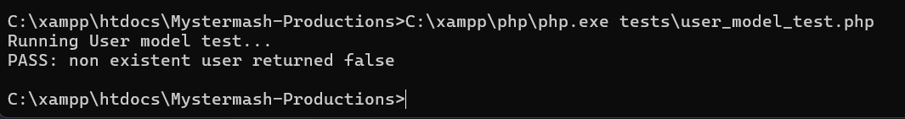

# **MysterMash Productions, Online Content Hub**

## Project Overview

 MysterMash Productions website is a online content hub built using PHP MySQL, HTML, and CSS. The platform encourages community interaction and is meant to help build a community around the Motivational Content. The site uses MVC structure.

## Features and Functionality

### User Authentication

* User registration and login
* Passwords securely hashed using password_hash()
* Session authentication
* Role based access either admin or user
* Disabled accounts cannot log in

### User Features

* User dashboard after login
* Create, update, and delete personal posts
* View of community feed is visible only to logged in users
* Logged in username displayed in the navigation
* Logout functionality ends the session

### Admin Features

* Admin dashboard
* Managing tutorials the admin can add & delete the YouTube embedded videos
* Disable user accounts
* Delete user accounts
* Moderate community posts delete any post
* Admin additional navigation links

### Community Feed ( I decided I did not want the users to be posting on the main page of the website accessible to everyone)

* Displays posts created by users
* Visible only to logged `in users
* Admin can delete posts
* Data stored in the database and updated dynamically

### Tutorials Section

* Admin managed tutorial videos
* YouTube embed URLs supported
* These tutorials are displayed on the public tutorials page
* Data pulled dynamically from database

### Membership & Informational Pages

* Membership tiers displayed
* About & Contact pages
* Buttons currently link to a shared **Under Construction** view
* Navigation highlights current page

### Tools Used in This Project

**Backend:** PHP using the MVC architecture

**Database:** MySQL

**Frontend:** HTML, CSS, basic JavaScript

**Security:** Prepared statements, password hashing, session validation

**Environment:** XAMPP (Apache, MySQL, PHP)

### **Unit Testing**

* Ensures the User model returns false when querying a not existing user
* Confirms database connection and how the model behaves
* This is a simple test, and its the only one but to satisfy the requirement I decided to atleast make one. I was looking into other options such as frameworks, which may have been easier and better quality of testing.

## **How to Set Up the Project Locally**

* Install XAMPP on your computer
* Open the XAMPP Control Panel
* Start Apache and MySQL
* Copy the MysterMash Productions project folder into the htdocs folder inside XAMPP
* The path should be C:\xampp\htdocs\Mystermash-Productions
* Open a web browser and go to phpMyAdmin
* Create a new database called mystermash_productions
* Import the provided SQL database dump file into the new database
* Open the database.php file inside the config folder
* Make sure the database name, username, and password match your local MySQL setup
* Open a browser and navigate to [http://localhost/Mystermash-Productions](http://localhost/Mystermash-Productions)
* The website should now load and function correctly

#### Running the Unit Test

Open command prompt and navigate to the project folder inside htdocs then run the user_model_test.php file using PHP. The test should output a PASS message.

## Future Improvements

* Responsive mobile layout
* Admin Post approval
* Admin/User dashboard consolidation
* User and Admin dropdown navigation for cleaner UI
* AI chatbot integration
* More advanced automated testing'
